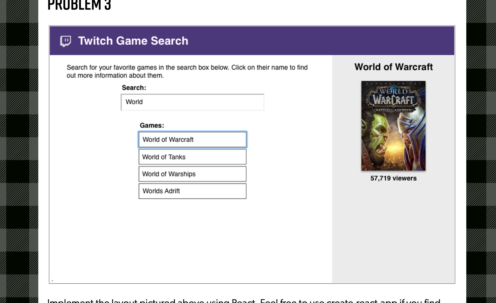

# AWS Challenge for CascadiaJS 2019

## Overview

## Current Version
1.0.0

### Description 
- This app was part of a coding challenge for the CascadiaJS 2019. I was asked to build out an app that used the [**Twitch**](https://dev.twitch.tv/docs/) API that made a GET request to their games endpoint. 
- I ended up winning the scholarship without having to submit the challenges. However I still wanted to complete this part of the challenge. 
- I slightly altered how the data and styling were asked to be shown. So my app does not look exact to the image provided.
- Built this app using _Create React App_ 
- For styling Bootstrap & Sass

_Also Twitch updated their response for their games endpoint. The updated endpoint response does not have "viewers" as a property._

* Image that was provided from the challenge

### To view this APP on your machine 

- Clone my repo from github into your terminal, then in your terminal _npm install_
- Once the install is completed, in your terminal type _npm start_
- The app should automatically open in your browser

### To use this application

* In the search bar input the exact game you want to look for. 
_Twitch's doc state that you need to be exact with the game you're looking for. You can't be vague like "Diablo" you must enter the exact edition like "Diablo 3"_
* If you search for a game, and the image is  Twitch's img, Twitch themselves do no have a proper image to display for the game. 

## Planned Enchancements 
In the upcoming release I plan to:

* To add more depth to the app, I'll be adding another endpoint to get streams for the game selected
* And to get videos of the game 

## Authors 
Brai Frauen

## License

MIT
